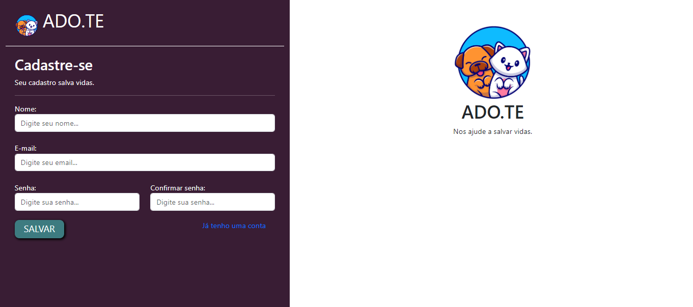
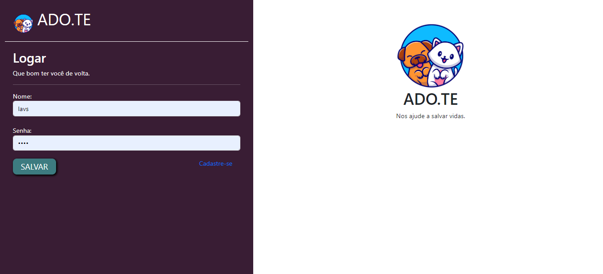
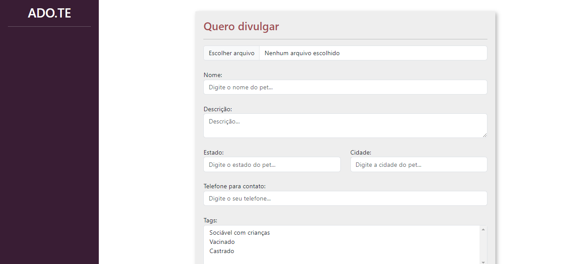
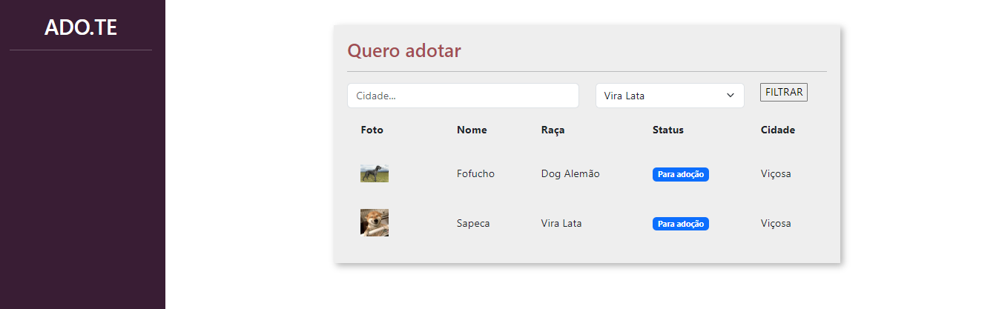
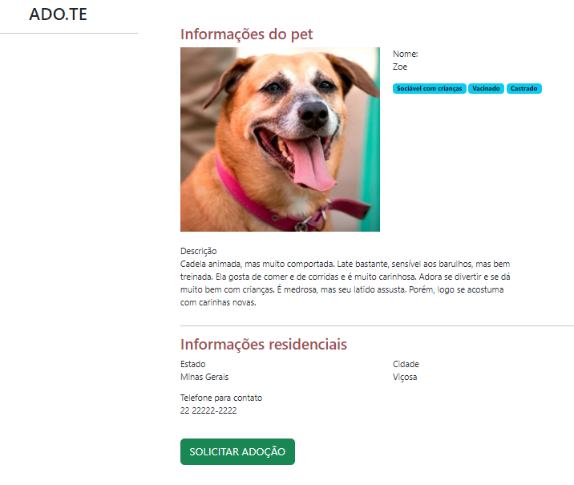
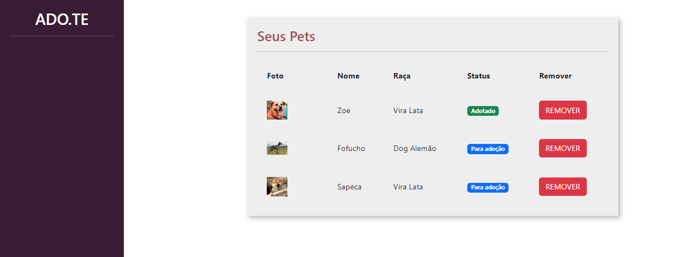
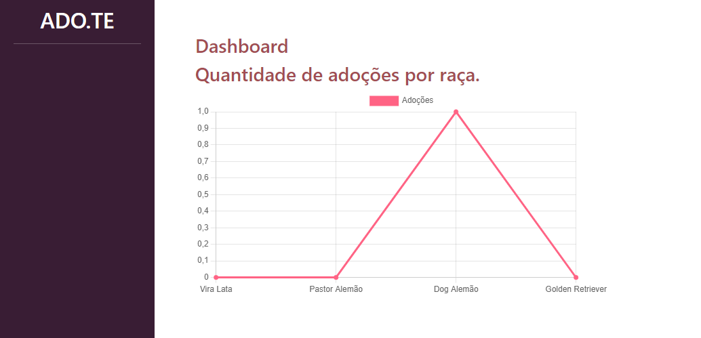

<h1 align="center"> ADO.TE </h1>

Projeto desenvolvido na PYSTACK WEEK com o Caio da Pythonando. 
 

 

</img>

  <a href="#-sobre-o-projeto">Sobre o projeto</a>&nbsp;&nbsp;&nbsp;|&nbsp;&nbsp;&nbsp; 
  <a href="#-layouts">Layouts</a>&nbsp;&nbsp;&nbsp;|&nbsp;&nbsp;&nbsp;
  <a href="#-tecnologias">Tecnologias</a>&nbsp;&nbsp;&nbsp;&nbsp;&nbsp;&nbsp;

 

# Sobre o projeto

Criação de um site para cadastro e adoção de pets. O usuário consegue criar uma conta, logar e realizar logout. É possível listar seus pets e também os disponíveis
para adoção, além de ser possível filtrá-los por cidade e raça. O usuário pode solicitar um pet para adoção e acompanhar sua solicitação. Através do formulário
de cadastro é possível adicionar tags que indiquem que o animal, por exemplo, já é castrado e vacinado. Também é possível realizar o upload de imagens dos pets.
Um dashboard foi adicionado para exibir um gráfico com a quantidade de pets adotados.

Para o projeto foi utilizado o ambiente virtual. 

# 📸 Layouts 

Tela de cadastro do usuário

</img>

Tela de login

</img>
 

Tela de cadastro do pet

</img>
 

Tela com os pets para adoção

</img>
 

Tela de informações do pet

</img>
 

Tela com os pets do usuário

</img>
 

Tela de dashboard exibindo o gráfico 

</img>
 

  

## 🚀 Tecnologias

Esse projeto foi desenvolvido com as seguintes tecnologias:
- Django
- Python
- HTML
- CSS
- JavaScript
- Git e Github

# Autor

Lavínia Souza Silveira

https://www.linkedin.com/in/lav%C3%ADnia-silveira-896b2624a/
